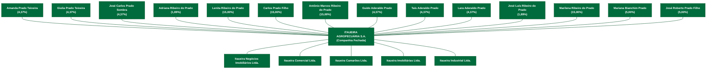

```mermaid
flowchart TD
    %% Definições de estilo
    classDef verde fill:#006b3c,stroke:#004d26,color:#ffffff,font-weight:bold,stroke-width:1px;

    %% Acionistas
    A1["Amanda Prado Teixeira<br/>(4,37%)"]:::verde
    A2["Giulia Prado Teixeira<br/>(4,37%)"]:::verde
    A3["José Carlos Prado Sombra<br/>(4,37%)"]:::verde
    A4["Adriana Ribeiro do Prado<br/>(1,89%)"]:::verde
    A5["Lenita Ribeiro do Prado<br/>(15,00%)"]:::verde
    A6["Carlos Prado Filho<br/>(15,00%)"]:::verde
    A7["Antônio Marcos Ribeiro do Prado<br/>(15,00%)"]:::verde
    A8["Guido Aderaldo Prado<br/>(4,37%)"]:::verde
    A9["Taís Aderaldo Prado<br/>(4,37%)"]:::verde
    A10["Lara Aderaldo Prado<br/>(4,37%)"]:::verde
    A11["José Luís Ribeiro do Prado<br/>(1,89%)"]:::verde
    A12["Marilena Ribeiro do Prado<br/>(15,00%)"]:::verde
    A13["Mariana Bianchim Prado<br/>(5,00%)"]:::verde
    A14["José Roberto Prado Filho<br/>(5,00%)"]:::verde

    %% Controladora
    ITA["ITAUEIRA AGROPECUÁRIA S.A.<br/>(Companhia Fechada)"]:::verde

    %% Subsidiárias
    S1["Itaueira Negócios Imobiliários Ltda."]:::verde
    S2["Itaueira Comercial Ltda."]:::verde
    S3["Itaueira Camarões Ltda."]:::verde
    S4["Itaueira Imobiliárias Ltda."]:::verde
    S5["Itaueira Industrial Ltda."]:::verde

    %% Agrupamento visual (acionistas em linha)
    A1 --- ITA
    A2 --- ITA
    A3 --- ITA
    A4 --- ITA
    A5 --- ITA
    A6 --- ITA
    A7 --- ITA
    A8 --- ITA
    A9 --- ITA
    A10 --- ITA
    A11 --- ITA
    A12 --- ITA
    A13 --- ITA
    A14 --- ITA

    ITA --- S1
    ITA --- S2
    ITA --- S3
    ITA --- S4
    ITA --- S5

    %% Forçar linhas retas (sem curvas e sem setas)
    linkStyle default stroke:#004d26,stroke-width:1.5px,fill:none;
```
